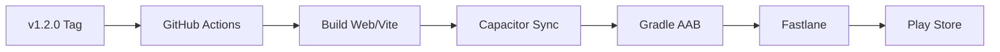

# Habitroid – Google Play Publishing Guide (2026 Edition)

## Release Architecture



| Component | Role |
| :--- | :--- |
| **Capacitor 8+** | Native bridge for Vite/React to Android |
| **Fastlane** | Automation for signing and Play Store distribution |
| **GitHub Actions** | CI/CD pipeline (Node 22+, JDK 17/21) |
| **Closed Testing** | Mandatory 14-day quality gate for new accounts |

---

## One-Time Setup

### 1. Developer Account & Testing Requirements
1.  **Register:** Sign up at [play.google.com/console](https://play.google.com/console).
2.  **The 14-Day Rule:** For personal accounts created after Nov 2023, you **cannot** publish to Production immediately.
    *   You must run a **Closed Test** with at least **12 testers**.
    *   Testers must be opted-in for **14 consecutive days**.
    *   Only after this period can you apply for Production access.

### 2. Native Environment
Ensure your local machine has:
*   **Node.js:** 22.0.0 or newer.
*   **Java:** JDK 17 or 21.
*   **Android Studio:** Version "Otter" (2025.2.1) or newer.

### 3. Generate Upload Keystore
If not already present, generate the signing key:
```bash
./scripts/generate-keystore.sh
```
*Note: This creates `android/app/upload-keystore.jks`. Backup this file securely (e.g., 1Password).*

### 4. Google Cloud & Service Account (for Automation)
To allow Fastlane and GitHub Actions to upload your app automatically, you need to create a "Service Account"—essentially a digital employee with permission to talk to the Play Store.

#### Step 4a: Create a Google Cloud Project
1.  Go to the [Google Cloud Console](https://console.cloud.google.com/).
2.  Click the project dropdown at the top (it usually says "Select a project") and click **New Project**.
3.  Name it `Habitroid` and click **Create**. Wait a few seconds for it to initialize.
4.  Ensure the new `Habitroid` project is selected in that same top dropdown.

#### Step 4b: Enable the Google Play Developer API
1.  In the Cloud Console sidebar, go to **APIs & Services > Library**.
2.  Search for **"Google Play Android Developer API"**.
3.  Click on it and click the blue **Enable** button. This allows your Cloud project to interact with the Play Store.

#### Step 4c: Create the Service Account
1.  Go to **APIs & Services > Credentials**.
2.  Click **+ Create Credentials** at the top and select **Service Account**.
3.  **Service account name:** `fastlane-deploy`.
4.  Click **Create and Continue**.
5.  **Grant access (Roles):** Search for and select **Service Account User** and **Service Account Token Creator**. (Note: In some newer configurations, **Browser** or **Editor** might also be needed if you hit permission errors later).
6.  Click **Done**.

#### Step 4d: Generate the JSON Key
1.  On the **Credentials** page, find your new service account under the "Service Accounts" list.
2.  Click the **Edit (pencil icon)** or click the email address.
3.  Go to the **Keys** tab at the top.
4.  Click **Add Key > Create new key**.
5.  Select **JSON** and click **Create**.
6.  A `.json` file will download to your computer. **Rename it** to `google-play-service-account.json` and move it to your project root.
    *   *Warning: Do not commit this file to Git! It's already in `.gitignore`.*

#### Step 4e: Link the Service Account in Play Console
1.  Open the [Google Play Console](https://play.google.com/console).
2.  Go to **Setup > API Access** (in the sidebar).
3.  You should see your Google Cloud project listed. If not, follow the prompts to link it.
4.  Scroll down to the **Service accounts** section. Find your `fastlane-deploy` account.
5.  Click **Manage Play Store permissions**.
6.  Under **App permissions**, click **Add app** and select **Habitroid**.
7.  Ensure it has permissions to:
    *   *Create, edit, and delete draft releases.*
    *   *Release to testing tracks.*
    *   *Release to production.*
8.  Click **Invite user** (or **Save changes**).

### 5. First Manual Upload

Google requires the very first App Bundle (`.aab`) to be uploaded manually via the web console to "register" the package name (`com.habitroid.app`) and link it to your signing key.

#### Step 5a: Create the App in Console (If you haven't yet)
1.  Go to [Play Console](https://play.google.com/console).
2.  Click **Create app** (top right).
3.  **App name**: `Habitroid`
4.  **Default language**: English (United States) - or your preference.
5.  **App or Game**: **Game**.
6.  **Free or Paid**: **Free**.
7.  Check the **Declarations** boxes (Developer Program Policies, US export laws).
8.  Click **Create app**.

#### Step 5b: Generate the Signed Bundle
Run this helper script. It will set the correct Java version and ask for your keystore password to sign the bundle properly:

```bash
./scripts/manual-bundle.sh
```

This will generate the **signed** file at:
`android/app/build/outputs/bundle/release/app-release.aab`

#### Step 5c: Upload to Internal Testing
1.  In the Play Console sidebar, find the **Testing** section.
2.  Click **Internal testing**.
3.  Click **Create new release**.
4.  If asked about "Play App Signing", click **Choose signing key** > **Use Google-generated key** (recommended).
5.  **App bundles**: Click **Upload**.
6.  Navigate to your project folder and select the `app-release.aab` file you just built.
    *   *Path: `habitroid/android/app/build/outputs/bundle/release/app-release.aab`*
7.  Wait for the upload to finish. If successful, you'll see the version code (e.g., 1) and size.
8.  **Release Name**: You can leave this as the version code or name it "Initial Release".
9.  **Release Notes**: Enter a short note like "Initial internal test release."
10. Click **Next** (bottom right).
11. You might see warnings (e.g., about testers not being assigned yet) — you can ignore these for now.
12. Click **Save** and then **Start rollout to Internal testing**.

**Success!** Your app is now registered. All future updates can be done automatically via the GitHub Actions pipeline or Fastlane commands.

---

## CI/CD Configuration

### GitHub Secrets
Add these to your repository settings for the `Android Release` workflow:

| Secret | Value / Source |
| :--- | :--- |
| `KEYSTORE_BASE64` | `cat android/app/upload-keystore.jks \| base64` |
| `KEYSTORE_PASSWORD` | The password used during keystore creation |
| `KEY_ALIAS` | Usually `upload` |
| `KEY_PASSWORD` | Usually the same as keystore password |
| `PLAY_STORE_SERVICE_ACCOUNT` | The content of your Service Account JSON key |

---

## Release Workflow

### 1. Version Bump & Tag (Automated)
The pipeline is triggered by version tags.
```bash
# 1. Bump version (patch, minor, or major)
npm run bump:patch

# 2. Push tags to GitHub
git push origin main --tags
```

### 2. Manual Deployment (Local)
If you need to bypass CI and deploy from your machine:
```bash
# Deploy to internal testing
npm run release:internal

# Promote to Beta
npm run release:beta
```

### 3. Promoting Tracks
Once a build is verified in Internal Testing:
1.  In Play Console, go to **Internal Testing**.
2.  Click **Promote Release** > **Closed Testing** (to start your 14-day clock).
3.  After 14 days, promote to **Production**.

---

## Maintenance & Troubleshooting

| Issue | Solution |
| :--- | :--- |
| **API Level Mismatch** | Update `android/variables.gradle` to target the latest Android SDK (API 35+ for 2026). |
| **Gradle Sync Failed** | Ensure `JAVA_HOME` points to JDK 17/21. |
| **Invalid Keystore** | Check that `KEYSTORE_BASE64` in GitHub Secrets doesn't contain newlines. |
| **"Version code used"** | Increment the version in `package.json` before tagging. |
